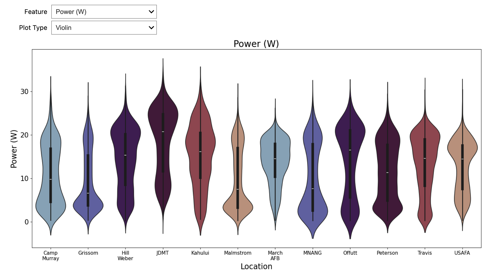
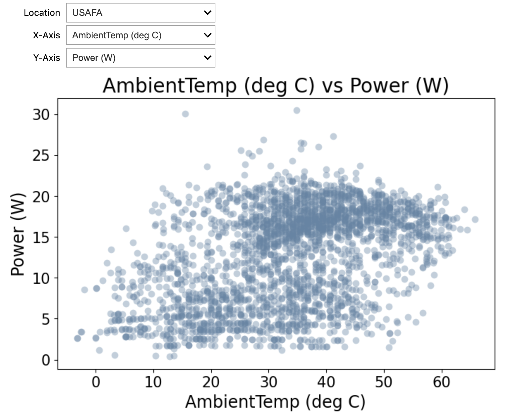

# Solar Forecasting Using Weather and Location Data

This project explores a photovoltaic (PV) dataset with a view to investigating its potential for forecasting power output. The dataset is taken from [Kaggle](https://www.kaggle.com/datasets/saurabhshahane/northern-hemisphere-horizontal-photovoltaic) and accompanies the paper [*Machine Learning Modeling of Horizontal Photovoltaics Using Weather and Location Data*](https://www.mdpi.com/1996-1073/13/10/2570) by Pasion et al. 

The two Jupyter notebooks respectively contain EDA for the entire dataset and examples of some interactive plots where the data is broken down by location. Code for making the plots is in `utils.py`.

## Motivation and aims
Solar energy is a key renewable resource and its adoption is forecast to grow steeply as the price of PV falls. The numerous benefits of solar adoption include the reduction of air pollution by replacing traditional fuel sources like wood and coal, thereby combating the climate crisis while improving health, stimulus to economies by creating employment opportunities and contributing to economic growth, and providing access to modern and reliable energy services in developing countries. 

Much of this growth is anticipated to be in distributed PV, i.e. horizontal cells installed on home- and building-owners' roofs, and this is forecasted to grow from 180 TWh to 6–10 TWh by 2050. As such, it is important to be able to reliably predict the output of such cells in order to integrate them with supply grids and support the transition to greener economies.

Initial aims of the project can be split into two main parts.
1. Following the paper, initial EDA of the entire dataset, then modelling to predict the power output for a given array and a comparison of the results with those of the paper.
2. Interactive plots of the dataset broken down by location. This along with aggregated information could be developed into an analytics dashboard.

Possible extensions once the above are completed include:
- an investigation of how far ahead of time it is possible to reliably forecast the power output with the given data;
- augmentation of the data with forecasts with an aim to reliably predict 24 hours in advance, which is about what would be required for the power to be a viable energy source for the grid.

## Dataset
The dataset contains 14 months of data taken at 12 Northern Hemisphere locations having varying climatic conditions; in total, we have 21045 data points. Data recorded was related to the following. 
- Location 
- Date 
- Time sampled 
- Altitude
- Humidity
- Ambient temperature
- Wind speed
- Visibility
- Pressure
- Cloud ceiling
- Power output.

An interesting aspect of the dataset is that it was taken in the absence of irradiation measurements, which is known to be a valuable predictor of power output: since irradiation can be time-consuming to measure and difficult to forecast with a high degree of certainty, the idea was to investigate the potential for accurate forecasting using more readily available and reliable measurements. 

Below is a screen grab showing the locations of the different PV sites across North America. The pop-ups on each location show the average power output and can be set to an hourly or monthly average.

Examination of the dataset revealed the following summary points. See the EDA notebook for details and to explore the data further. 

### Range of data collection and missing values
At each location, the data ranges from 10:00 to 15:45 at 15-minute intervals from 23 May 2017 to 4 Oct 2018 (499 days in total). Although there are no explicit nulls in the dataset, the data is patchy depending on the particular location, i.e. we don't have consistent data available for every 15 minutes throughout every day for any of the sites. The sparsity of data is visualised below using comparison to a hypothetical ideal situation of available readings for every 15-minute interval from 10:00 to 15:45 for a given site. We can see that even in the best-case scenario we have only 23% of the data, which would likely limit the use of the dataset for time-series forecasting.

### General variation of power and other features
The power largely exhibits approximately bimodal distributions with the locations of the central peaks varying from site to site and with peak frequency occurring at high power in some cases (e.g. USAFA) and low power in others (e.g. Malmstrom). 

There is also interesting variation in average monthly power output depending on the location: at some sites there is a smooth increase towards the middle of the year while at others there is much more variation between adjacent months. Some kind of cyclical encoding will be necessary here to ensure that, e.g., the values recorded in December are 'close' to those in January for modelling purposes.

Temperature, pressure and wind speed show broad distributions with varying degrees of skew. Transforms to make the distributions more normal may help at the modelling stage. In contrast, the cloud ceiling and visibility both have a high peak to large values indicating that encoding the data as, e.g., high, medium and low may be advantageous when modelling. 

### Correlation matrix
The following is a correlation matrix of the features, which shows a mixture of positive and negative correlations with power. Note that (unsurprisingly) pressure and altitude are perfectly correlated with one another and don't vary with location. Consequently, the latter was discarded on the basis that the former showed more variation with power output.

These correlations can also be confirmed visually using a scatterplot as with, for example, the broadly positive correlation between temperature and power at USAFA shown below.

 

## Summary 
The above EDA serves as an initial step ahead of predictive modelling using the dataset. The data is clean and validated by comparison with the source paper. The next step is to obtain a baseline model using the current features followed by iterative feature engineering and selection, and comparison with the results of the paper.

#### References
1. C. Pasion et al. *Energies* **2020**, 13, 2570; [doi:10.3390/en13102570](https://www.mdpi.com/1996-1073/13/10/2570)
2. Project Drawdown [*Distributed Solar Voltaics*](https://drawdown.org/solutions/distributed-solar-photovoltaics#:~:text=Distributed%20solar%20photovoltaics%20(PV)%20are,and%20natural%20gas%20power%20plants.)