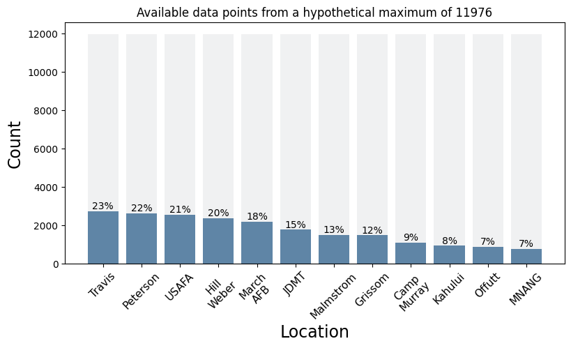

# Solar Forecasting Using Weather and Location Data

This project conducts explores a photovoltaic dataset with a view to investigating its potential for forecasting power output using machine learning. The dataset is taken from [Kaggle](https://www.kaggle.com/datasets/saurabhshahane/northern-hemisphere-horizontal-photovoltaic) and accompanies the paper [*Machine Learning Modeling of Horizontal Photovoltaics Using Weather and Location Data*](https://www.mdpi.com/1996-1073/13/10/2570) by Pasion et al. 

## Motivation and aims
Solar energy is a key renewable resource and its adoption is forecast to grow steeply as the price of photvoltaics (PV) falls. Much of this growth is anticipated to be in distributed PV, i.e. horizontal cells installed on home- and building-owners' roofs, and as such it is important to be able to reliably predict the output of such cells in order to integrate them with supply grids. 

Initial aims of the project are as follows.
1. To replicate the results of the paper using standard machine learning algorithms.
2. To investigate how far ahead of time it is possible to reliably forecast the power output with the given data.
3. As a possible extension, to augment the data with forecasts and aim to predict reliably 24 hours in advance, which is about what would be required for the power to be a viable energy source for the grid. This will depend on largely on the quantity and quality of the data for inference purposes.

## Dataset
It contains 14 months of data taken at 12 Northern Hemisphere locations having varying climatic conditions; in total, we have 21045 data points. Data recorded was related to the following: 
- Location 
- Date 
- Time sampled 
- Altitude
- Humidity
- Ambient temperature
- Wind speed
- Visibility
- Pressure
- Cloud ceiling
- Power output of the cell.

An interesting aspect of the dataset is that it was taken in the absence of irradiation measurements, which is known to be a valuable predictor of power output: since irradiation can be time-consuming to measure and difficult to forecast with a high-degree of certainty, the idea was to investigate the potential for accurate forecasting using more readily available and reliable measurements. 

MAP OF SITES IN US

## Summary of EDA
Examination of the dataset revealed the following summary points. See the EDA notebook for details and to explore the data further. 

### Range of data collection and missing values
At each location, the data ranges from 10:00 to 15:45 at 15-minute intervals from 23 May 2017 to 4 Oct 2018 (499 days in total). Although there are no explicit nulls in the dataset, the data is patchy depending on the particular location, i.e. we don't have consistent data available for every 15 minutes throughout every day for any of the sites. The sparsity of data is visualised below using comparison to a hypothetical ideal situation of available readings for every 15-minute interval from 10:00 to 15:45 for a given site. We can see that even in the best-case scenario we have only 23% of the data, which would likely limit the use of the dataset for time-series forecasting.

### Variation of power and other features with location

#### References
1. C. Pasion et al. *Energies* **2020**, 13, 2570; [doi:10.3390/en13102570](https://www.mdpi.com/1996-1073/13/10/2570)