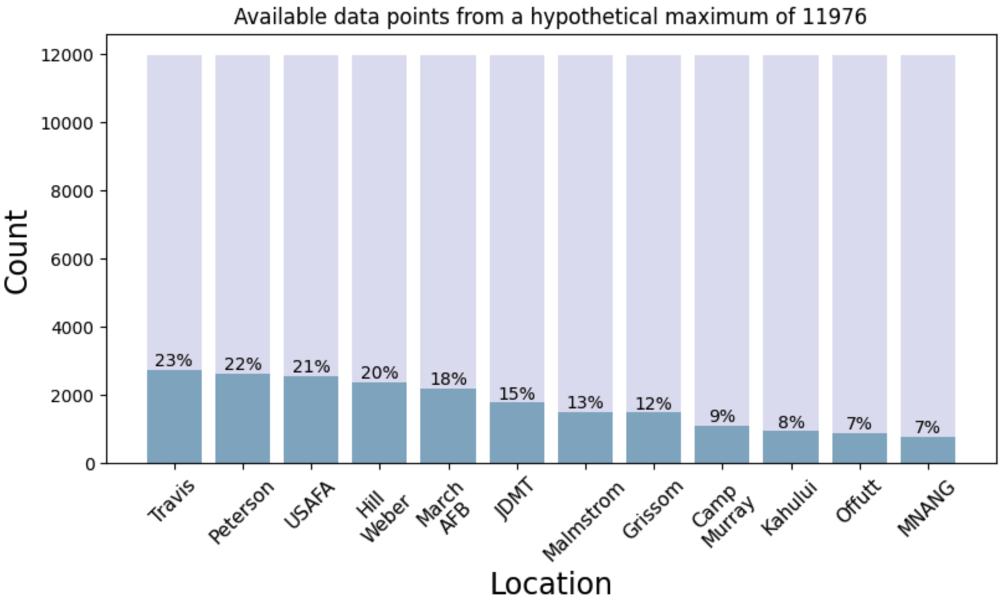
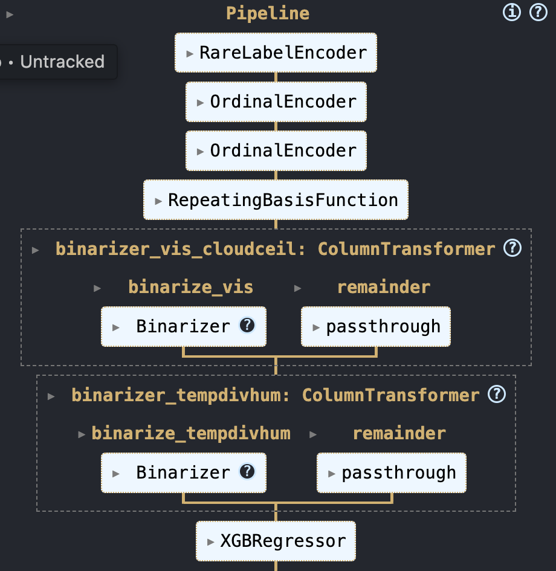

<!--  -->

# Solar forecasting with Weather and Location Data

Solar energy is a key renewable resource – about 6% of the world's electricity is currently provided by solar panels covering an area the size of Jamaica. The growth of this resource is growing exponentially with a doubling of capacity every three years, and its adoption is forecast to continue to grow steeply as the price of PV falls. The numerous benefits of solar adoption include the reduction of air pollution by replacing traditional fuel sources like wood and coal, thereby combating the climate crisis while improving health, stimulus to economies by creating employment opportunities and contributing to economic growth, and the provision of access to modern and reliable energy services in developing countries. Much of this growth is anticipated to be in distributed photovoltaics (PV), i.e. horizontal cells installed on home- and building-owners' roofs, and this is forecasted to grow from 180 TWh to 6–10 TWh by 2050. As such, it is important to be able to reliably predict the output of such cells in order to integrate them with supply grids and support the transition to greener economies.

## Project Overview

This project uses a PV dataset with aggregated readings from 12 sites across the US to predict the power output. The main steps carried out were as follows.

- Initial exploratory data analysis (see `eda.ipynb`)
- Notes on experiments with further investigation and subsequent modifications to the feature engineering pipeline to improve performance (see `notebooks` directory)
- Scripts (see `src` directory):
    - `eda.py`: code for plots used in EDA, the notebooks and analysis of results
    - `preprocessing.py`: code for loading and preprocessing the data and building the feature engineering pipeline
    - `train.py`: code for setting up the cross-validation loop and logging experiment tracking to CometML
    - `engine.py`: main script for running experiments. 
- Deployment:
    - `inference.py`: a script containing a Flask app for inference
    - `Dockerfile`: instructions for building a container for deployment
    - `inference_test.py`: code for testing deployment. 

#### Software and Packages

The project was run in a VS Code virtual environment running Python 3.12.4. The main packages used were as follows.

- General Purpose: `os`, `dotenv`, `typing`, `pipenv`
- Data Manipulation: `numpy`, `pandas`, `datetime`
- Data Visualization: `matplotlib`, `seaborn`, `folium`
- Machine Learning: `sklearn`, `feature-engine`, `sklego`, `comet-ml`
- Deployment: `requests`, `flask`, `gunicorn`, `docker`

## Data

The dataset is taken from [Kaggle](https://www.kaggle.com/datasets/saurabhshahane/northern-hemisphere-horizontal-photovoltaic) and accompanies the paper [*Machine Learning Modeling of Horizontal Photovoltaics Using Weather and Location Data*](https://www.mdpi.com/1996-1073/13/10/2570) by Pasion et al. 

The dataset contains 14 months of data taken at 12 Northern Hemisphere locations having varying climatic conditions; in total, we have 21045 data points. Data recorded was related to the following. 
- Location 
- Date 
- Time sampled 
- Altitude
- Humidity
- Ambient temperature
- Wind speed
- Visibility
- Pressure
- Cloud ceiling
- Power output

An interesting aspect of the dataset is that it was taken in the absence of irradiation measurements, which is known to be a valuable predictor of power output. Since irradiation can be time-consuming to measure and difficult to forecast with a high degree of certainty, the idea was to investigate the potential for accurate forecasting using more readily available and reliable measurements. 

Below is a screen grab showing the locations of the different PV sites across North America. The pop-ups on each location show the average power output and can be set to an hourly or monthly average.


### Data Preprocessing
At each location, the data ranges from 10:00 to 15:45 at 15-minute intervals from 23 May 2017 to 4 Oct 2018 (499 days in total). Although there are no explicit nulls in the dataset, the data is patchy depending on the particular location, i.e. we don't have consistent data available for every 15 minutes throughout every day for any of the sites. The sparsity of data is visualised below using comparison to a hypothetical ideal situation of available readings for every 15-minute interval from 10:00 to 15:45 for a given site. We can see that even in the best-case scenario we have only 23% of the data, which would likely limit the use of the dataset for time-series forecasting as an extension to the project.



During EDA it was noted that the descriptive statistics for some features didn't match those given in the paper. Some investigating showed that the differences were due to approximately constant scaling factors for each feature, indicating some change of units had taken place. The function `fix_units()` calculates these and transforms the features accordingly, leaving a new set of statistics that closely matches those in the paper.

## Results and Evaluation

### Evaluation metrics and cross-validation
To avoid overfitting and assist generalisation, the dataset was split such that 20% of data points were put to one side and the remaining 80% were used for feature engineering. To further ensure good generalisation, a five-fold cross-validation was set up wherein a validation set was also split off to be used for early stopping to optimise training time. The code implementation can be found in `src/train.py`. 

To evaluate each model, we used the $R^2$ score (or the coefficient of determination), given by
```math
R^2 = 1 - \frac{\sum_i(y_i - \hat{y}_i)^2}{\sum_i(y_i - \bar{y})^2},
```
where $\{y_i\}$ are the target values, $\{\hat{y}_i\}$ are the predicted values for each row $X_i$ of the feature matrix, and $\bar{y}$ is the mean of the target. If the numerator in the second term, the mean-squared error, is zero, then we have a perfect score of $R^2 = 1$. 

The model trained was an XGBoost regressor. 

### Baseline and feature engineering
Using the season and location as categorical features, extracting the month and hour from the datetime, and leaving the rest as floats gave a baseline of 0.6572.

Feature engineering steps experimented with were as follows. For more detail, see the corresponding notebooks.
- Categorical features:
    - Grouping of rare labels
    - Ordinal encoding via ordering categories using the mean target values
    - Target encoding
- Temporal features:
    - Radial basis functions with tuning of the number of functions and widths. 
- Discrete features:
    - PCA to transform latitude and longitude
    - Same as categorical features
- Continuous features:
    - Binarization
    - Tree discretization
- Creating new features:
    - Features were created via domain knowledge and from PCA on the temperature, humidity and windspeed

The final feature pipeline is given below and resulted in a training R2 of 0.663 and a test score of 0.671, potentially indicating that there is underfitting, which could be mitigated by, for example, increasing the training proportion. Nevertheless, this is a modest increase on the baseline and there are numerous step to be taken to improve this further. 

<!--  -->


### Hyperparameter tuning
Optuna was used to tune the hyperparameters of the model (code implementation in `tuning.ipynb`). The final hyperparameter values are given in the table below and increased the final test score to ~0.684

| Hyperparameter     | Value |
|--------------------|-------|
| `eta`              | 0.025 |
| `max_depth`        | 9     |
| `subsample`        | 0.57  |
| `colsample_bytree` | 0.57  |
| `min_child_weight` | 9.56  |
| `lambda`           | 7.29  |
| `alpha`            | 9.31  |

## Deployment
The final model and dependencies for inference were 


### References
1. C. Pasion et al. *Energies* **2020**, 13, 2570; [doi:10.3390/en13102570](https://www.mdpi.com/1996-1073/13/10/2570)
2. Project Drawdown [*Distributed Solar Voltaics*](https://drawdown.org/solutions/distributed-solar-photovoltaics#:~:text=Distributed%20solar%20photovoltaics%20(PV)%20are,and%20natural%20gas%20power%20plants.)
3. Super Data Science: ML & AI Podcast, [episode 804](https://open.spotify.com/episode/5rz25YVgRP9vZXYXLCwWmF?si=99e2b2aaba994eaa)
4. *Speed & Scale* John Doerr (Penguin, 2021)